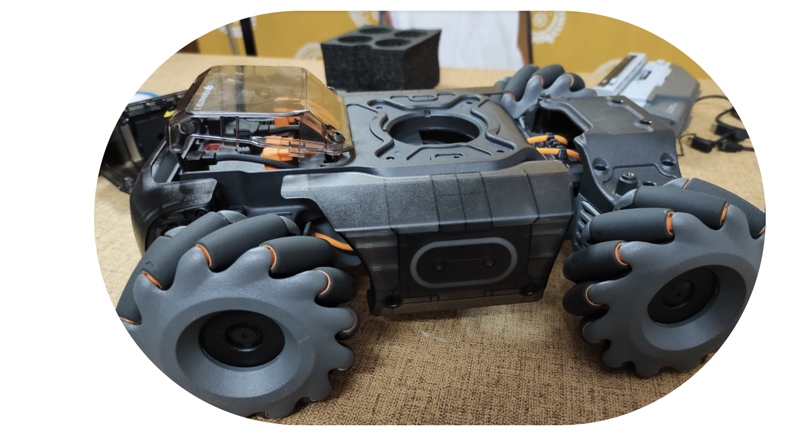

# An Ultimate Tutorial for DJI Robomaster S1 Beginners




The RoboMaster S1 is an educational robot that provides users with an in-depth understanding of science, math, physics, programming, and more through captivating gameplay modes and intelligent features.

## Table of Contents

1. [Top 10 Features](#top-10-features)
2. [Stimulus that S1 Recognises](#Stimulus-that-S1-recognises)
3. [Getting Started](#getting-started)
4. [Items Check and Assembly](#items-check-and-assembly)
5. [Asembly the Mecanum Wheels](#assembly-the-mecanum-wheels)
6. [Attaching the Gimbal to the Chassis](#attaching-the-gimbal-to-the-chassis)
7. [Mounting the Gel Bead Container and Intelligent Battery](#mounting-the-gel-bead-container-and-intelligent-battery)
8. [Hacking into Robomaster S1](#hacking-into-robomaster)
9. [References](#references)

## Top 10 Features


- Support for Python and Scratch programming language
- 46 Programmable Components - all in DIY mode
- 6 Programmable AI Module
- Low-latency HD FPV
- Scratch & Python Coding
- 4WD Omnidirectional Movement
- Intelligent Sensing Armor
- Multiple Exciting Battle Modes
- Innovative Hands-On Learning
- Two shooting methods: gel beads and infrared beams.
- Capability to capture photos and record 1080p videos; without a microSD card, it supports only 720p.


## Stimulus that S1 recognises

- Clapping Recognition: the S1 can recognize two or three consecutive claps and be programmed to execute custom responses.
- Gesture Recognition: the S1 can detect human gestures such as hand or arm signals and be programmed to execute custom responses.
- S1 Robot Recognition: the S1 can detect other RoboMaster S1 units.
- Vision Marker Recognition: the S1 can identify 44 kinds of official Vision Markers, which are comprised primarily of numbers, letters, and special characters. All of the files for these Vision Markers can be downloaded at insert web address.
- Line Recognition: the S1 can detect and follow blue, red, and green tracks with a width of approximately 15-25 mm.


## How it works?

- The RoboMaster S1 can be operated using a computer or a smart device via the touchscreen and gamepad. When using the gamepad with a touchscreen device, the robot can also be operated using an external mouse, which can be connected through a dedicated USB port
- Users can connect to the RoboMaster S1 via Wi-Fi or a router. When connecting via Wi-Fi, your mobile device or computer connects to the Wi-Fi of the S1. Connection via router provides broader signal coverage, which allows multiple control methods for robots to operate simultaneously on the same network.
- Flat surfaces such as wood, carpet, tile, and concrete are optimal for operating the S1. Users should avoid surfaces that are too smooth as the S1 wheels may have problems gaining enough traction for precise control. Surfaces with fine particles like sand or dirt should be avoided.


## Table of Contents

1. [Getting Started](#getting-started)
2. [Items Check and Assembly](#items-check-and-assembly)
3. [Asembly the Mecanum Wheels](#assembly-the-mecanum-wheels)
4. [Attaching the Gimbal to the Chassis](#attaching-the-gimbal-to-the-chassis)
5. [Mounting the Gel Bead Container and Intelligent Battery](#mounting-the-gel-bead-container-and-intelligent-battery)
6. [Hacking into Robomaster S1](#hacking-into-robomaster)

# Getting Started

- Installing Robomaster Python Module on MacOS

```
conda create --name dji python=3.7
```

```
conda activate dji
```

```
pip install robomaster
```


# Steps to assemble Robomaster


# Items Check and Assembly


# Assembly the Mecanum Wheels


# Attaching the Gimbal to the chassis


# Mounting the Gel Bead Container and Intelligent Battery


## Get Ready!


## Hacking into Robomaster


### What you need

- Android SDK Platform‐Tools (https://developer.android.com/studio/releases/platform‐tools)
- Micro USB Cable
- Latest Robomaster S1 App & Firmware
- Windows 10 (might or mightn't work for MacOS)


### Step by step instructions

- Unzip the Android SDK Platform‐Tools somewhere in your system
- Use the Intelligent Controller Micro USB Port and connect the S1 to your computer.
- Start the Robomaster S1 application. Go to the Lab, create a new Python application and
paste the following code:

```
def root_me(module):
 __import__=rm_log.__dict__['__builtins__']['__import__']
 return __import__(module,globals(),locals(),[],0)
builtins=root_me('builtins')
subprocess=root_me('subprocess')
proc=subprocess.Popen('/system/bin/adb_en.sh',shell=True,executable='
/system/bin/sh',stdout=subprocess.PIPE,stderr=subprocess.PIPE)
```

- Run the Code within the S1 Lab. If you followed the steps correctly there should be no
compilation errors. The Console will show: Execution Complete

- Don’t close the S1 Application! Open an Explorer window and go to the directory which holds
the earlier extracted Android Platform Tools. Open a PowerShell in this directory (Shift +
Right‐Click)

- Run the ADP command to list the devices: 

```
.\adb.exe devices
```

You should see something like this:


-  Execute: 

```
.\adb.exe shell
```


## DJI Specific Commands

```
dji
dji_amt_board       dji_derivekey       dji_monitor         dji_verify
dji_blackbox        dji_hdvt_uav        dji_net.sh          dji_vision
dji_camera          dji_log_control.sh  dji_network
dji_chkotp          dji_mb_ctrl         dji_sw_uav
dji_cpuburn         dji_mb_parser       dji_sys
```


### Checking IP address

```
 ip a
1: lo: <LOOPBACK,UP,LOWER_UP> mtu 65536 qdisc noqueue state UNKNOWN
    link/loopback 00:00:00:00:00:00 brd 00:00:00:00:00:00
    inet 127.0.0.1/8 scope host lo
       valid_lft forever preferred_lft forever
8: rndis0: <BROADCAST,MULTICAST,UP,LOWER_UP> mtu 1500 qdisc pfifo_fast state UP qlen 1000
    link/ether 0a:f8:f6:bb:55:64 brd ff:ff:ff:ff:ff:ff
    inet 192.168.42.2/24 brd 192.168.42.255 scope global rndis0
       valid_lft forever preferred_lft forever
9: wlan0: <BROADCAST,MULTICAST,UP,LOWER_UP> mtu 1500 qdisc pfifo_fast state UP qlen 1000
    link/ether 60:60:1f:cd:95:f7 brd ff:ff:ff:ff:ff:ff
    inet 192.168.2.1/24 brd 192.168.2.255 scope global wlan0
       valid_lft forever preferred_lft forever
```


 


## References

- [Robomaster S1 Videos](https://www.dji.com/robomaster-s1/video)
- [Robomaster S1 Courses](https://www.dji.com/robomaster-s1/video-courses)
